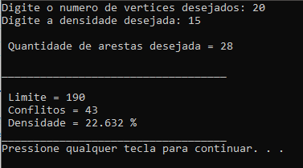
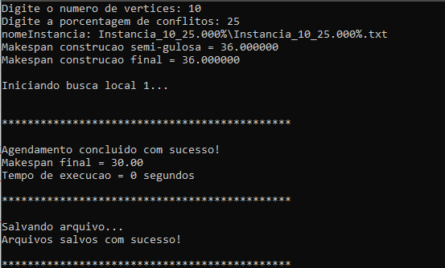
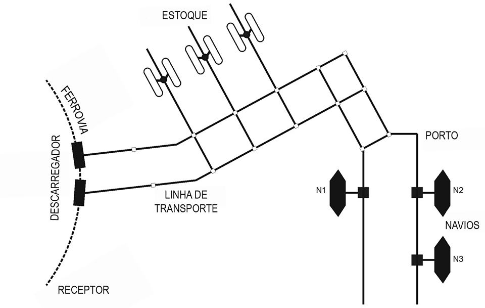
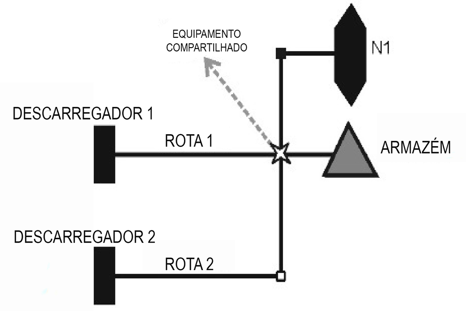
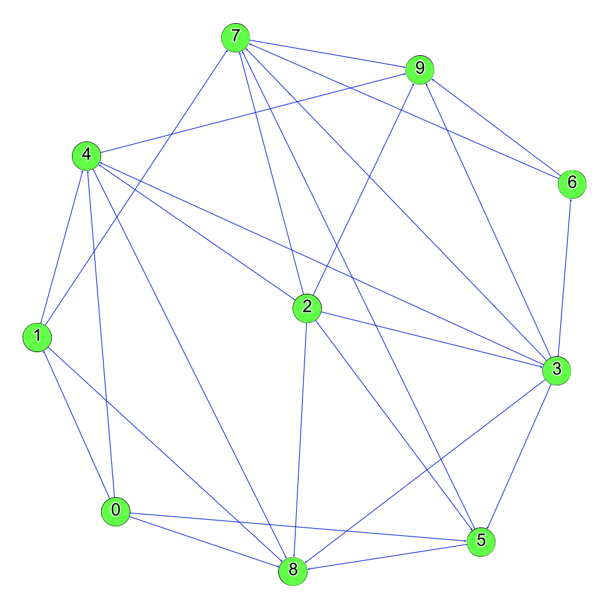

# Metaheurística Grasp aplicada na resolução de Problemas de Sequenciamento baseados em Grafo de Conflito

Em diversas aplicações há a necessidade de agendar tarefas em uma linha de produção / transporte e deseja-se obter um agendamento que minimize o tempo gasto para concluí-las. Quando essas tarefas possuem conflitos entre si, isto é, quando algumas delas não podem ser executadas ao mesmo tempo que outras, temos um problema complexo. Uma especificação desse problema ocorre em sistemas de trasportes como terminais portuários que apresentam um sistema de rotas de cargas muito complexo e que possibilita uma grande quantidade de combinações possíveis. O objetivo desse algoritmo é utilizar Heurísticas baseadas em GRASP pra otimizar essas rotas, reduzindo assim o tempo para carregar e descarregar os navios.

## Modo de uso

Este repositório contém instâncias prontas de grafos de conflito e um gerador de grafos. Para criar uma instancia basta executar o programa `geradorGrafos` e informar a quantidade de vértices e a densidade de conflitos. O programa irá gerar uma pasta com vários arquivos, um arquivo .glm que serve para gerar o gráfico vizualmente com o programa [Gephi](https://gephi.org/), uma matriz de adjacencia e um arquivo com as informações dos conflitos.



O arquivo `main` recebe uma instância de grafo de conflito como entrada e encontra um agendamento das operações com um bom makespan. Para utilizá-lo basta informar o número de vertices e a densidade da instância a ser lida. O programa automaticamente abrirá a pasta dessa isntancia e lerá os arquivos necessários. Assim, para utilizar o arquivo main é preciso antes gerar uma instância com o programa `geradorGrafos`.




## Introdução

O grande avanço no setor de transportes deu inicio a uma verdadeira revolução no processo de globalização. A demanda por capacidade e agilidade em entregas tornou os sistemas de transporte, incluindo o naval, extremamente complexo, demandando diariamente milhares de toneladas de produtos a serem transportados. Os terminais portuários são responsáveis por carregar e descarregar navios de carga e fornecer suporte de armazenamento para intermediar a troca da carga com outro meios de transporte como caminhões e trens. Devido a enorme quantidade de produtos carregados pelos navios a carga e descarga se torna extremamente demorada e torna bastante trabalhoso alocar os pátios de armazenamento para os produtos. Por esses motivos é de grande relevância que sejam desenvolvidos meios de otimizar as rotas dos produtos e o processo de alocação dos pátios, reduzindo o tempo para descarregar os navios. Assim, esses fatores motivam a busca de um algoritmo que gere um bom agendamento de rotas com conflitos.

A partir disso, busca-se desenvolver um algoritmo capaz de otimizar o agendamento das rotas com conflitos, reduzindo o tempo necessário para a conclusão das rotas.

### Detalhamento do problema do porto

Na figura 1 é representado o esquema de um terminal portuário. Os navios atracam nos cais e aguardam para serem carregados ou descarregados. Os navios podem ter seus produtos descarregados diretamente para um vagão de trem, para um caminhão ou para um pátio de armazenamento de carga. Um conjunto de equipamentos é instalado entre o cais, os pátios e os demais veículos terrestres para realizar o transporte dos produtos. A combinação entre os equipamentos utilizados para realizar esse transporte gera uma rota.

Os portos possuem uma grande quantidade de rotas para transportar os produtos e várias dessas rotas compartilham os mesmos equipamentos, impossibilitando a execução de ambas rotas simultaneamente, como é representado na figura \ref{rotas}. Nesse caso, um dos produtos deve aguardar o outro ser transportado para em seguida poder continuar a sua rota.




Além da complexidade em evitar os conflitos é desejável gerar um agendamento em que ocorra menos trocas de produtos nos pátios de armazenamento. Isto ocorre pois em portos que trabalham com produtos a granel, como soja, milho e demais grãos, é preciso lavar os pátios para armazenar outro produto no local. O mesmo ocorre com produtos do mesmo tipo, mas de purezas diferentes.

## Modelamento do problema

O modelo matemático proposto utiliza um grafo de conflito para representar as incompatibilidades das rotas, onde os vértices representam as rotas dos produtos e as arestas representam que existe um conflito entre elas. Os conflitos serão medidos em termos de densidade e essa medida é feita calculando a razão entre o número de arestas no grafo pelo número de arestas de um grafo completo com o mesmo número de vértices. 

$$ densidade = { 2 * arestas \over {vertices \times (vertices - 1)}} $$


A figura abaixo ilustra um grafo de conflitos com 10 vértices e 50% de densidade.



Uma vez estabelecido o modelo do problema analisamos o comportamento das soluções para diferentes quantidades de rotas e conflitos. Variando-se o número de rotas percebemos um aumento na complexidade do problema, pois assim mais possibilidades de agendamento serão possíveis. Analisando o problema quando se varia a densidade de conflitos notamos um pico na complexidade do problema para 50\% de conflito. Quando a densidade de conflitos é muito pequena ou muito grande o agendamento é mais simples. No caso de não haver conflitos todas as rotas podem ser realizadas simultaneamente e o makespan seria o tempo demandado pela rota mais demorada. Por outro lado, no caso em que todas as rotas tiverem conflitos entre si todas as possibilidades de agendamento possuirão o mesmo makespan, a soma dos tempos de execução de todas as rotas, pois só poderá haver uma única rota em funcionamento a cada momento, tornando trivial a solução. Esse comportamento de mantém para densidades não muito distantes dos extremos. Por esse motivo o maior desafio se encontra em realizar agendamentos em que a densidade de conflitos entre as rotas é intermediária.

Ao revisar a literatura vemos que esse é um problema NP-Completo, isto é, um problema que não pode ser tratado computacionalmente em tempo viável por algoritmos conhecidos. Assim, mudamos nossa estratégia para tentar encontrar uma solução boa em tempo viável ao invés da solução ótima.

## Algoritmo Proposto

O problema consiste em agendar as rotas de forma a alcançar o menor tempo para sua conclusão evitando os conflitos entre as operações em um tempo viável de execução. Os dados do problema foram representados em um arquivos texto e agrupados de forma a facilitar a leitura do arquivo de instancia no programa. Nesse arquivo há o índice da rota, tempo de execução, número de conflitos e uma lista com os índices das rotas que possui conflito, respectivamente. 

A seguir é ilustrado um exemplo de instancia refente às 10 rotas com 50\% de conflito representado pelo grafo da figura 5.

```
0 7.00 4 1 4 5 8 
1 2.00 4 0 4 7 8 
2 8.00 6 3 4 5 7 8 9 
3 9.00 7 2 4 5 6 7 8 9 
4 6.00 6 0 1 2 3 8 9 
5 3.00 5 0 2 3 7 8 
6 12.00 3 3 7 9 
7 1.00 6 1 2 3 5 6 9 
8 12.00 6 0 1 2 3 4 5 
9 7.00 5 2 3 4 6 7  
```

Nesse exemplo, a rota 6 dura 12 horas para ser executada e possui 3 conflitos com as rotas 3, 7 e 9.

De forma semelhante ao arquivo de entrada, retorna-se como saída do algoritmo um arquivo com todas as rotas ordenas e em sequencia seguidas por seus tempos de inicio e término, e o tempo total de execução no final, como mostrado no exemplo abaixo. 

```
rota: 0 Tinicio = 4.00 Tfim = 11.00
rota: 1 Tinicio = 1.00 Tfim = 3.00
rota: 2 Tinicio = 33.00 Tfim = 41.00
rota: 3 Tinicio = 17.00 Tfim = 26.00
rota: 4 Tinicio = 11.00 Tfim = 17.00
rota: 5 Tinicio = 1.00 Tfim = 4.00
rota: 6 Tinicio = 33.00 Tfim = 45.00
rota: 7 Tinicio = 0.00 Tfim = 1.00
rota: 8 Tinicio = 41.00 Tfim = 53.00
rota: 9 Tinicio = 26.00 Tfim = 33.00
Makespan = 53.0
```

O que abstraímos da figura 5 é a relação entre as rotas, ou seja, o quanto elas são dependentes uma das outras. Nesse exemplo de instancia, como as rotas possuem mais de um conflito, a escolha de agendar uma rota para ser realizada primeiro impacta em deixar as outras com conflito em espera. Entretanto, poderia haver um outro agendamento que escolha outra rota para ser realizada no inicio e isso impacte em deixar menos rotas em espera, alcançando um menor makespan. Conhecido o problema vamos algora abordar a solução proposta para o mesmo.

Para o problema abordado é proposto a utilização da meta-heurística GRASP (Greedy Randomized Adaptive Search Procedure). O GRASP consiste em realizar perturbações na solução através de uma busca local de forma a diminuir o makespan. A busca local modifica a solução encontrada na construção utilizando um processo de melhoramento iterativo. Durante o processo de melhoramento da solução observa-se a variação do makespan encontrando e a partir do momento em que a solução encontrada deixa de melhorar, espera-se ter encontrado um mínimo local. Essa perturbação na solução é repetida até que um limite de iterações ou de tempo seja atingido.

Como o GRASP analisa apenas a variação do makespan não conseguimos encontrar garantidamente o mínimo global, pois não há como distinguir entre um mínimo global e local com esse método. Assim, o GRASP não nos garante uma solução ótima, apenas uma boa solução na vizinhança. Para contornar esse problema desenvolvemos uma busca global que gera uma pertubação na solução de forma alterar a vizinhança de exploração. A repetição desse processo aumenta as chances de a solução convergir para o ótimo global.

O algoritmo de construção, algorithm 1, recebe uma lista que contém os índices das rotas, o tempo gasto para completar a rota, um booliano indicando se a rota foi agendada e os tempos de inicio e fim do agendamento, que inicialmente possuem um valor inválido. O primeiro passo consiste em realizar uma construção semi-gulosa em que utiliza-se o algoritmo de ordenação quicksort para ordenar as rotas de acordo com um método guloso. Foram desenvolvidos três métodos gulosos que selecionam as rotas de acordo com o tempo gasto, quantidade de conflitos e pelo produto tempo gasto por quantidade de conflitos. Em seguida, escolhe-se uma rota aleatoriamente para começar no tempo zero e realiza-se um agendamento guloso para as demais. Após a construção inicial, executa-se algumas iterações de refinamento da construção, alterando-se a rota inicial e reagendando as rotas seguindo o mesmo método guloso. Utiliza-se um parâmetro FB para limitar as iterações realizando-se N/FB iterações de refinamento, onde N é o número total de rotas a serem agendadas. O melhor agendamento desse processo é usado como a solução de construção.

Terminada a construção realiza-se uma busca local variando os tempos de inicio das rotas. Foram desenvolvidas três buscas locais e uma busca global para variar ao máximo as perturbações. 

De forma geral, as buscas locais permutam as rotas no vetor de rotas reagendando a solução alterando o tempo de início das rotas de acordo com suas posições no vetor. Além do embaralhamento gerado para variar a solução, a relação de dependência entre as rotas gerada pelos conflitos acrescenta um fator de aleatoriedade às buscas locais. Desse modo, mesmo trocando somente a posição de duas rotas no vetor, o novo agendamento é significativamente diferente do anterior.

Na busca local a função EmbaralharRotas oculta a implementação da permutação realizada pela busca local. A seguir será abordado as permutações realizadas por cada busca. O parâmetro FatorGlobal controla o número de vezes que a busca global será solicitada no programa.

## Conclusão

Os experimentos computacionais mostram que o algoritmo proposto é eficiente e rápido para instancias pequenas e uma boa opção para instancias grandes. Sua complexidade é O($n^3$) e é bastante simples de ser utilizado. Desse modo, qualquer problema que envolva sequenciar e agendar tarefas, sejam elas com ou sem conflitos, esse algoritmo apresentará bons resultados, bastando ajustar adequadamente os parâmetros FB, FatorGlobal e MaxIteration para atingir uma boa variabilidade de busca. 

As aplicações para esse algoritmo são bastante amplas e comuns. Nos terminais portuários espera-se utilizá-lo para otimizar as rotas dos produtos para agilizar o processo de carregamento e descarregamento dos navios. De forma semelhante, o algoritmo pode ser utilizado para agendar cirurgias em hospitais, apresentando conflitos entre os recursos hospitalares tais como bolsas de sangue, remédios, disponibilidade de salas, médicos e etc; Agendamento de encomendas para transportadoras apresentando conflitos pela disponibilidade de caminhões e espaço de carga; Agendamento de turmas escolares e atividades relacionas; e qualquer problema de sequenciamento de tarefas/serviços.
